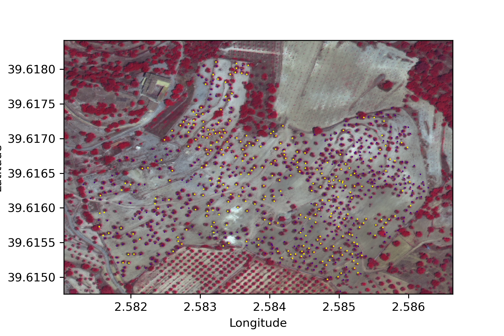

# Xylella fastidiosa Detection using Remote Sensing and Machine Learning


This repository contains the code for detecting *Xylella fastidiosa* infection in almond trees using satellite imagery and machine learning techniques. The project combines remote sensing data with qPCR test results to train neural network classifiers capable of identifying infected trees.

## Table of Contents

- [Overview](#overview)
- [Project Structure](#project-structure)
- [Workflow](#workflow)
- [Installation](#installation)
- [Usage](#usage)
- [Results](#results)
- [Data](#data)
- [Contributing](#contributing)

---

## Overview

*Xylella fastidiosa* is a plant pathogenic bacterium that affects a wide range of crops, including olive and almond trees. Early detection is crucial for disease management and preventing its spread. This project uses:

- **WorldView-3 satellite imagery** (8 spectral bands)
- **Pansharpening techniques** to enhance spatial resolution
- **Vegetation indices** (NDVI, etc.) for feature extraction
- **Artificial Neural Networks (ANN)** for binary classification

### Key Features

- Automated tree segmentation using NDVI thresholding and watershed algorithm
- Integration of qPCR laboratory test results as ground truth labels
- Cross-validation training with early stopping
- SHAP values for model interpretability
- Support for various data augmentation strategies (oversampling, undersampling, cost-sensitive learning)

---

## Project Structure

```
Main_file/
├── Raster_loading.ipynb          # Satellite image loading and pansharpening
├── Preprocessing.ipynb           # Tree segmentation and qPCR labelling
├── Xylella_detection.ipynb       # Main detection workflow
├── Prediction_analysis.ipynb     # SHAP analysis and model interpretation
├── xylella_detection_nn.py       # Neural network training script
├── xylella_detection_cnn.py      # CNN-based detection
├── models.py                     # Neural network architectures
├── data_preprocessing.py         # Data loading and preprocessing utilities
├── callbacks.py                  # Custom Keras callbacks
├── results_summary.py            # Results aggregation
│
├── Data/
│   ├── Satellite/                # Raw satellite imagery
│   └── QPCR tests/               # Ground truth qPCR test results
│
├── Processed Data/               # Intermediate processed data
├── Classification datasets/      # Train/test splits
├── Classification results/       # Model outputs and metrics
│
├── Images/                       # Generated figures
│   ├── Satellite_imagery/
│   ├── Trees_segmentation_imagery/
│   ├── QPCR_test_imagery/
│   └── Train_test_layout/
│
└── general_utils/                # Utility functions
    ├── file_management.py
    ├── gdal_utils.py
    └── other_utils.py
```

---

## Workflow

The detection pipeline consists of three main stages:

### 1. Raster Loading (`Raster_loading.ipynb`)

- Load panchromatic and multispectral satellite images
- Perform pansharpening to enhance spatial resolution
- Apply Top-of-Atmosphere (TOA) corrections
- Calculate vegetation indices


*False-color composite (NIR-R-G) of the study area*

### 2. Preprocessing (`Preprocessing.ipynb`)

#### Tree Segmentation
- NDVI-based thresholding to identify vegetation
- Watershed algorithm for individual tree segmentation


*Tree segmentation process: RGB image → NDVI thresholding → Watershed segmentation*

#### qPCR Label Assignment
- Associate laboratory qPCR test results with segmented trees
- Match trees to nearest qPCR sample point (within 3m threshold)


*Distribution of qPCR test samples over the study area*


*Trees labeled according to qPCR results (infected vs. healthy)*

### 3. Classification (`xylella_detection_nn.py`)

- Train ANN classifier using spectral bands as features
- K-fold cross-validation (default K=3)
- Model selection based on validation AUC score

---

## Installation

### Prerequisites

- Python 3.8+
- GDAL library (for raster processing)

### Setup

```bash
# Clone the repository
git clone https://github.com/JavierGalvan9/Xylella_fastidiosa_detection.git
cd Xylella_fastidiosa_detection/Coding/Main_file

# Create virtual environment
python -m venv venv
source venv/bin/activate  # On Windows: venv\Scripts\activate

# Install dependencies
pip install -r requirements.txt
```

### Required Packages

```
numpy
pandas
matplotlib
scikit-learn
tensorflow>=2.0
keras
geopandas
osgeo (GDAL)
scikit-image
scipy
shap
imbalanced-learn
```

---

## Usage

### Running the Notebooks

Execute the Jupyter notebooks in order:

1. `Raster_loading.ipynb` - Prepare satellite imagery
2. `Preprocessing.ipynb` - Segment trees and assign labels
3. `Xylella_detection.ipynb` - Train and evaluate models

### Command-Line Training

For batch training with custom parameters:

```bash
python xylella_detection_nn.py \
    --num_epochs 10000 \
    --n_hidden_layers 1 \
    --use_spectral_bands \
    --cost_sensitive
```

#### Available Arguments

| Argument | Default | Description |
|----------|---------|-------------|
| `--num_epochs` | 10000 | Maximum training epochs |
| `--n_hidden_layers` | 1 | Number of hidden layers |
| `--oversampling` | False | Apply ADASYN oversampling |
| `--undersampling` | False | Apply undersampling |
| `--cost_sensitive` | False | Use class-weighted loss |
| `--dropout` | False | Enable dropout regularization |
| `--use_spectral_bands` | True | Use 8 spectral bands as features |
| `--use_indices` | False | Include vegetation indices |
| `--L2_regularizer` | False | Apply L2 regularization |

### SHAP Analysis

Run `Prediction_analysis.ipynb` to generate feature importance plots:

```python
import shap

# Load best model
best_model = keras.models.load_model('ann_classifier_best_new.h5')

# Calculate SHAP values
explainer = shap.KernelExplainer(best_model.predict, X_test_summary)
shap_values = explainer.shap_values(X_test)

# Generate summary plot
shap.summary_plot(shap_values, X_test)
```

---

## Results

### Model Performance

The best performing model achieves classification results saved in `Classification results/` directory, including:

- Confusion matrices for validation and test sets
- Training history (loss, accuracy, AUC)
- Best model weights (`ann_best_classifier.h5`)

### Output Files

Each training run creates a directory with:

```
Classification results/
└── num_epochs_10000 n_hidden_layers_1 .../
    ├── ann_best_classifier.h5        # Best model weights
    ├── training_info.txt             # Training parameters and history
    ├── best_model_validation_info.txt # Validation metrics
    └── best_model_testing_info.txt    # Test set performance
```

---

## Data

### Input Data

- **Satellite Imagery**: WorldView-3 multispectral (8 bands) and panchromatic images
- **qPCR Results**: GeoJSON files with laboratory test coordinates and results

### Spectral Bands

| Band | Name | Wavelength (nm) |
|------|------|-----------------|
| 1 | Coastal | 400-450 |
| 2 | Blue | 450-510 |
| 3 | Green | 510-580 |
| 4 | Yellow | 585-625 |
| 5 | Red | 630-690 |
| 6 | Red Edge | 705-745 |
| 7 | NIR-1 | 770-895 |
| 8 | NIR-2 | 860-1040 |

---

## Contributing

Contributions are welcome! Please feel free to submit a Pull Request.

1. Fork the repository
2. Create your feature branch (`git checkout -b feature/AmazingFeature`)
3. Commit your changes (`git commit -m 'Add some AmazingFeature'`)
4. Push to the branch (`git push origin feature/AmazingFeature`)
5. Open a Pull Request

---

## Citation

If you use this code in your research, please cite:

```bibtex
@software{xylella_detection,
  author = {Galvan, Javier},
  title = {Xylella fastidiosa Detection using Remote Sensing and Machine Learning},
  year = {2024},
  url = {https://github.com/JavierGalvan9/Xylella_fastidiosa_detection}
}
```

---

## License

This project is licensed under the MIT License - see the [LICENSE](LICENSE) file for details.

---

## Acknowledgments

- WorldView-3 satellite imagery
- qPCR laboratory testing data
- SHAP library for model interpretability
